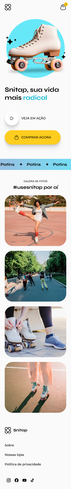

# Landing Page – Snitap Patins

Landing page animada desenvolvida para a marca fictícia **Snitap Patins**, com foco em **animações em CSS**, **design moderno** e **experiência visual interativa**.

O projeto simula a apresentação de um produto esportivo, explorando movimento, cores vibrantes e microinterações.

## Visão Geral

Este projeto foi desenvolvido utilizando apenas **HTML5 e CSS3**, sem o uso de JavaScript, com o objetivo de demonstrar domínio de:

- Animações avançadas em CSS.
- Layout responsivo.
- Organização e modularização de estilos.
- Criação de interfaces visuais atrativas para produtos.

## Tecnologias e Conceitos Aplicados

- **HTML5 semântico**.
- **CSS3 moderno**:
  - Flexbox.
  - CSS Grid.
  - CSS Nesting.
  - Variáveis CSS (Design Tokens).
  - Keyframes e animações complexas.
- **Media Queries** (mobile-first).
- **Microinterações** (hover, transições e efeitos visuais).
- **Google Fonts** (Inter, Montserrat e Syne).

## Estrutura do Projeto

* `index.html`: Estrutura principal da landing page.
* `styles/index.css`: Arquivo principal que importa todos os módulos de estilo.
* `styles/global.css`: Reset de estilos, variáveis globais e definições base.
* `styles/header.css`: Estilização do cabeçalho.
* `styles/hero.css`: Seção principal de apresentação do produto.
* `styles/banner.css`: Seção com banner promocional com animação infinita.
* `styles/gallery.css`: Galeria de imagens com exibição de usuários.
* `styles/footer.css`: Estilização do rodapé.
* `assets/`: Imagens, ícones e elementos gráficos do projeto.

## Funcionalidades

- Seção **Hero** com texto animado e entrada de elementos visuais.
- Botões com sombras, transições e efeitos de escala.
- Banner com rolagem contínua e gradiente animado.
- Galeria de imagens com:
  - Hover effects.
  - Animações baseadas em scroll.
- Rodapé com microinterações em links e ícones sociais.
- Layout totalmente responsivo (mobile e desktop).

## Diferenciais Técnicos

- Animações complexas feitas exclusivamente com **CSS**.
- Uso de **keyframes reutilizáveis** para mobile e desktop.
- Design tokens centralizados via `:root`.
- Código modular e legível, facilitando manutenção.
- Atenção a detalhes visuais e fluidez de animações.

## Como Visualizar o Projeto

Acesse diretamente pelo link: [Snitap Patins no GitHub Pages](https://dandiels.github.io/patins-animation/).

Ou, se preferir:

1. Clone este repositório:

   ```bash
   git clone https://github.com/Dandiels/patins-animation.git
   ```
2. Abra o arquivo `index.html` em um navegador web.

## Capturas de Tela

<div align="center">
  <table>
    <tr>
      <td align="center" valign="top">
        <strong>Versão Mobile</strong><br />
        
      </td>
      <td align="center" valign="top">
        <strong>Versão Desktop</strong><br />
        
      </td>
    </tr>
  </table>
</div>

## Créditos

Projeto desenvolvido como parte dos estudos de **HTML** e **CSS**, com referência aos materiais da **Rocketseat**.